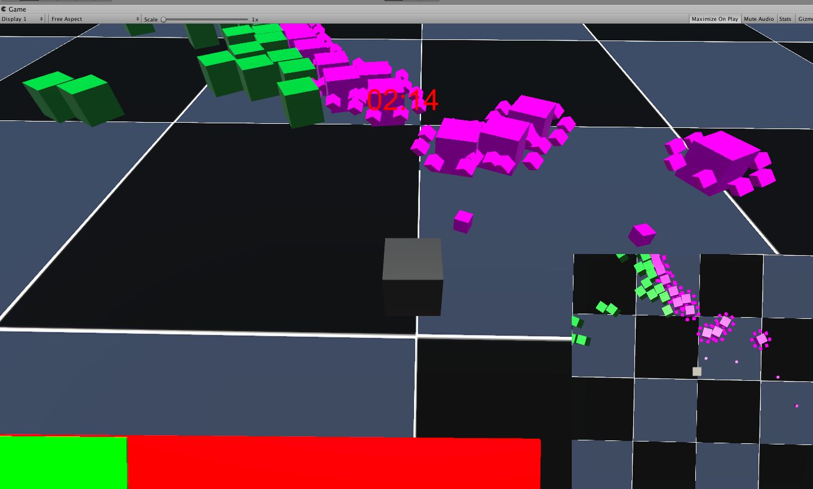
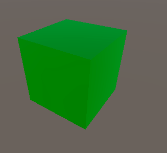

# KTL Kill To Live

## Concept

The idea of this game is too make a fun 3rd parson shooter using only cubes and blocky textures. The common theme I feel allowed for a focus on the actual gameplay. The game is played entirely with the mouse. It was made with Unity and is a small scale 3d shooter played entirely with the mouse. Your goal is to survive as long as possible.

## Controls

Shoot           left mouse button.
Move forward    right mouse button.
Turn            move the mouse.

## Enemies

### Zombie:

Slow damages on contact.

### Runner:

Fast damages on contact.

### Wizard:

Shoots projectiles that damage you and has a shield of projectiles

### Bomber:

Flashes and explodes when close.

## License
[MIT](https://choosealicense.com/licenses/mit/)
